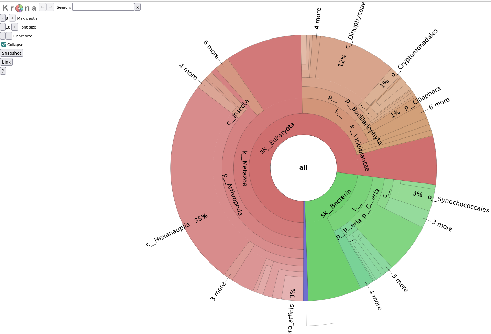

.. _data_products:

Description of ``metaGOflow``'s data products
=============================================


Quality filtering step
-----------------------

- ``*.fastq.trimmed.fasta`` **files** 
Filtered .fasta files of the forward (R1) and reverse (R2) reads. Its content strongly depends on the 
``fastp``-related :doc:`/args_and_params` parameters. 
A record in a .fasta file consists of 2 parts: a *header* that always starts with a ``>``` and describes
the sequence (experiment id, coordinates etc.) and the sequence. 
Example:

.. code-block:: bash

    >SRR1620013.60-C038EACXX:5:1101:06662:02714-1
    GAATGGAATGGAATGGAATGGAACCTGTCTCTTATACACATCTCTGAGCGGGCTGGCAAG
    GCAGACCGATCACGATCTCGTATGCCGTCCTCTGCTTGACA

- ``.fastq.trimmed.qc_summary`` **files**
A report for the number of sequences removed after each trimming/filtering task
for the forward and the reverse reads.
Example:

.. code-block:: bash

    Submitted nucleotide sequences	100000
    Nucleotide sequences after format-specific filtering	3495
    Nucleotide sequences after length filtering	3477
    Nucleotide sequences after undetermined bases filtering	3477

- ``.merged.fasta`` **file**
A ``.fasta`` file with the filtered, merged reads; the forward and reverse reads merge into one. 

.. code-block:: bash

    >SRR1620013.10-C038EACXX:5:1101:04403:02479-1-merged-101-9
    GGGTGGGACTGCAAGCTTTCCAAACTACAGAAAATGCCAGGACGACTATTTTAAAATATT
    TTTAAAATCTGTAAAATAATTGGAATGAACAATACACATATTCCTGTCTC


- ``*.merged.qc_summary`` **file**
Like the ``.fastq.trimmed.qc_summary`` file but for the case of the merged reads.


- ``fastp.html`` **file**
An .html file with visual contents of the quality of both the forward and the reverse 
and the merged reads. 
For a thorough description of this file, the reader may watch this `video <https://youtu.be/VrIW4EcHly4?t=510>`_.


- ``*merged.unfiltered_fasta`` **file** 
Often, problematic characters in headers of .fasta and/or .fastq files may appear. 
In this file, the merged .fastq file has been edited so such characters have been replaced with dashes.


.. code-block:: bash

    @V1:1:HWLTKDRXY:1:2202:19524:21151-1-merged-108-0
    GCAAAGAGTACGCTGTCGTAGTTTCTCAAGTCTTTGCCGTGCCCCAATGCCTGATTCGCCGCAAAGGTGTCTAACCCTTGTTCTCGTTGCAGGGAGTAGACCTTCACC
    +
    FFFFFFFF:FFFFFFFFF:FFFFFFFFFFFFFFFFFFFFFFFFF:FFFFFFFFFFFFFFFFFFFF:FFFFFFFFFFF:FF:F:FFFF:FFFFFFFFFFFFFFF:FFFF


This file is necessary for running the `mOTUs package <https://github.com/motu-tool/mOTUs>`_.


Taxonomy inventory step 
------------------------

- ``*.merged.motus.tsv`` **file**
A three column file with the mOTUs found, their taxonomic assignment and their abundance:

.. code-block:: bash

    #mOTU	consensus_taxonomy	count
    meta_mOTU_v25_13231	k__Archaea|p__Euryarchaeota|c__Euryarchaeota class incertae sedis|o__Euryarchaeota order incertae sedis|f__Euryarchaeota fam. incertae sedis|g__Euryarchaeota gen. incertae sedis|s__uncultured Candidatus Thalassoarchaea euryarchaeote	12


- ``RNA-counts`` **file**

A file with the number of the LSU and SSU counts on the sample:

.. code-block:: bash 

    LSU count	709
    SSU count	475


- ``*.merged_LSU.fasta.mseq.gz`` and ``*.merged_SSU.fasta.mseq.gz`` **files** 

Compressed files with rRNA sequences used for taxonomic indentification along with their hits and scores. 
The decompressed files consist of 13 columns with the taxonomy assignment in the last one. 

.. code-block:: bash

    #query	dbhit	bitscore	identity	matches	mismatches	gaps	query_start	query_end	dbhit_start	dbhit_end	strand		SILVA	
    V1:1:HWLTKDRXY:1:2276:10818:25551-1-merged-143-11-LSU_rRNA_eukarya/q53-152	GEAN01107426.394.3747	98	0.9900000095367432	99	1	0	0	100	2246	2346	+		sk__Eukaryota;k__Metazoa;p__Arthropoda;c__Hexanauplia;o__Calanoida;f__Temoridae;g__Eurytemora;s__Eurytemora_affinis	
    V1:1:HWLTKDRXY:1:2247:17598:35540-1-merged-151-107-LSU_rRNA_bacteria/q1-253	CP000828.5638205.5641084	163	0.8589743375778198	201	32	1	0	233	26	260	+		sk__Bacteria;k__;p__Cyanobacteria;c__;o__Synechococcales	


- ``*.merged_LSU.fasta.mseq.tsv`` and ``*.merged_SSU.fasta.mseq.tsv`` **files**

Abundance tables consisting of 4 columns mentioning the OTU id and the taxonomic assignment of each. 
In addition, the NCBI Taxonomy Id of each assignment is mentioned in the last column. 


.. code-block:: bash

    # Constructed from biom file
    # OTU ID	LSU_rRNA	taxonomy	taxid
    1039	4.0	sk__Archaea;k__;p__Euryarchaeota;c__Thermoplasmata	183967
    3616	46.0	sk__Bacteria	2
    30206	2.0	sk__Bacteria;k__;p__Bacteroidetes;c__Bacteroidia	200643
    12319	1.0	sk__Bacteria;k__;p__Bacteroidetes;c__Bacteroidia;o__Marinilabiliales;f__Marinifilaceae	1573805


- ``*.merged_LSU.fasta.mseq.txt`` and ``*.merged_SSU.fasta.mseq.txt`` **files**

Like the ``*.fasta.mseq.tsv`` files but without the head columns and keeping only the abundance and the taxonomy columns, splitting 
the latter to its taxonomic levels. 


.. code-block:: bash 

    4	sk__Archaea	k__	p__Euryarchaeota	c__Thermoplasmata
    46	sk__Bacteria
    2	sk__Bacteria	k__	p__Bacteroidetes	c__Bacteroidia
    1	sk__Bacteria	k__	p__Bacteroidetes	c__Bacteroidia	o__Marinilabiliales	f__Marinifilaceae

These files are used as input to build the Krona plots. 


- ``*.fasta.mseq_json.biom`` **files** 

The output of the MAPseq classification as json in a biom format 


- ``*.fasta.mseq_json.biom`` **files** 

The biom format is based on HDF5 to provide the overall structure for the format. 
`HDF5 <https://www.hdfgroup.org>`_ is a widely supported binary format with native parsers available within many programming languages.


- ``krona.html`` **files**


A hierarchical visual component of the taxonomic profile based on the LSU and the SSU accordingly. 





Gene prediction step 
--------------------


Functional annotation step 
--------------------------


Assembly step 
-------------


