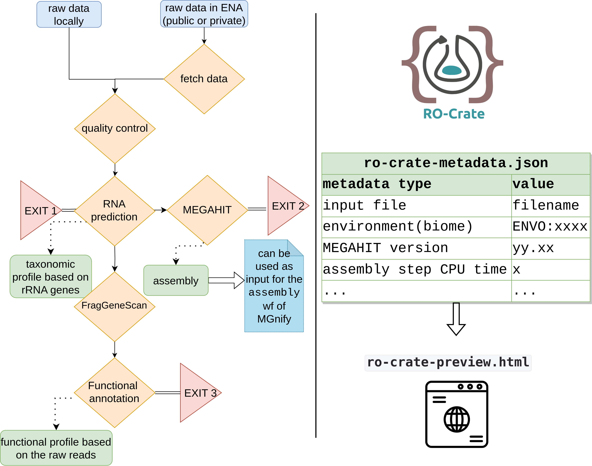

Welcome to metaGOflow's documentation!
===================================

**metaGOflow** is a 
`Common Workflow Language (CWL) <https://commonwl.org>`_
based pipeline
for the analysis of shotgun metagenomic data at the sample level.
It was initially built to address the needs of the 
`EMO BON community <https://www.embrc.eu/services/emo-bon>`_
but it can be used for any type of shotgun sequencing data.
``metaGOflow`` is based on the tools and subworkflow implemented in the 
framework of `MGnify <https://github.com/EBI-Metagenomics/pipeline-v5>`_.

It produces a `Research Object Crate (RO-Crate) <https://www.researchobject.org/ro-crate/>`_
as its main output that includes the taxonomic inventory and/or the functional profile of the sample
based on the user's settings. 

Check out the :doc:`usage` section for further information, including
:ref:`installation` instructions for the project.

.. note::

   This project is under active development.
   The source code is available on `GitHub <github.com/emo-bon/MetaGOflow>`_.

Citation: currently under revision in *GigaScience*.

Contents
--------

.. toctree::

   installation
   args_and_params
   usage
   data_products
   faq
